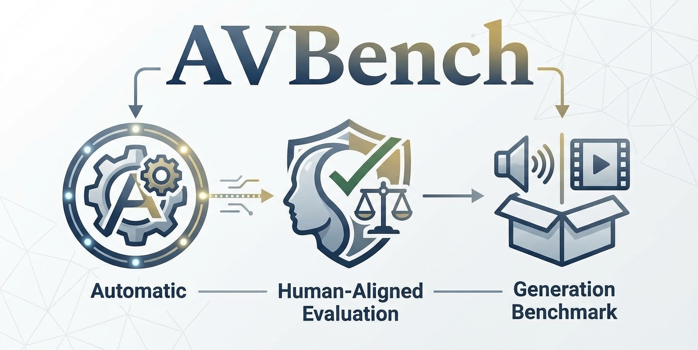

[](https://huggingface.co/iiiiii123/AVBench_model)
[](https://huggingface.co/datasets/iiiiii123/AVBench)
[](https://huggingface.co/spaces/iiiiii123/AVBenchLB)
[](https://yajialiang.github.io/AVBench-site/)

# AVBench

Open-source benchmark workspace for video/audio quality and alignment evaluation.

## Repository Layout

- `video_data/`: Input videos to be evaluated.
	- You can put videos directly under this folder, or split them into subfolders (recommended).
- `dataset/`: Text/prompt datasets used by content-accuracy evaluation.
- `evaluation/`: Evaluation scripts.
- `results/`: Generated evaluation outputs (CSV/JSON).

## Evaluation Scripts

- `evaluation/evaluate_aesthetics.py`: Visual aesthetics (frame-based predictor).
- `evaluation/evaluate_dover.py`: Video quality with DOVER++ (aesthetic/technical/overall).
- `evaluation/evaluate_syncnet.py`: Lip-sync quality with SyncNet.
- `evaluation/evaluate_audiobox_aesthetics.py`: Audio aesthetics with Audiobox metrics.
- `evaluation/evaluate_nisqa.py`: Speech quality/naturalness with NISQA.
- `evaluation/evaluate_DF_arena_from_videos.py`: Anti-spoofing detection with DF_Arena.
- `evaluation/evaluate_speech_content_accuracy.py`: ASR-based speech content accuracy.
- `evaluation/evaluate_vt_consistency.py`: Video-text consistency evaluation.
- `evaluation/evaluate_at_consistency.py`: Audio-text consistency evaluation.
- `evaluation/evaluate_av_consistency.py`: Audio-video consistency evaluation.

## One-Time Environment Setup

Install the base runtime once:

```bash
conda create -n avbench python=3.11 -y
conda activate avbench
pip install -r requirements.txt
sudo apt-get update && sudo apt-get install -y ffmpeg
```

Rule:
- For requirements-only evaluators, this setup is enough.
- For repo-dependent evaluators, also follow the original repo environment/model instructions in the next section.

## Repo-Dependent Evaluators (Must follow original repo setup)

| Script | Original Repo / Tool | Setup Docs | Required Model / Checkpoint |
|---|---|---|---|
| `evaluation/evaluate_aesthetics.py` | [discus0434/aesthetic-predictor-v2-5](https://github.com/discus0434/aesthetic-predictor-v2-5) | [README](https://github.com/discus0434/aesthetic-predictor-v2-5/blob/main/README.md) | Follow original repo weight setup (or install package and set `AESTHETIC_PREDICTOR_ROOT`) |
| `evaluation/evaluate_dover.py` | [VQAssessment/DOVER](https://github.com/VQAssessment/DOVER) | [README](https://github.com/VQAssessment/DOVER/blob/master/README.md) | `DOVER_plus_plus.pth` |
| `evaluation/evaluate_syncnet.py` | [bytedance/LatentSync](https://github.com/bytedance/LatentSync) | [README](https://github.com/bytedance/LatentSync/blob/main/README.md) | `syncnet_v2.model` |
| `evaluation/evaluate_nisqa.py` | [gabrielmittag/NISQA](https://github.com/gabrielmittag/NISQA) | [README](https://github.com/gabrielmittag/NISQA/blob/master/README.md) | `nisqa.tar` |
| `evaluation/evaluate_audiobox_aesthetics.py` | [audiobox-aesthetics / audio-aes](https://github.com/facebookresearch/audiobox-aesthetics) | [README](https://github.com/facebookresearch/audiobox-aesthetics/blob/main/README.md) | Optional/custom Audiobox checkpoint |

Detailed external links (quick access):

- Aesthetic Predictor v2.5
	- Repo: https://github.com/discus0434/aesthetic-predictor-v2-5
	- License: https://github.com/discus0434/aesthetic-predictor-v2-5/blob/main/LICENSE
- DOVER / DOVER++
	- Repo: https://github.com/VQAssessment/DOVER
	- Checkpoint guidance: https://github.com/VQAssessment/DOVER/blob/master/README.md
- LatentSync (SyncNet)
	- Repo: https://github.com/bytedance/LatentSync
	- Sync model usage: https://github.com/bytedance/LatentSync/blob/main/README.md
- NISQA
	- Repo: https://github.com/gabrielmittag/NISQA
	- Model/checkpoint usage: https://github.com/gabrielmittag/NISQA/blob/master/README.md
- Audiobox Aesthetics (audio-aes)
	- Repo: https://github.com/facebookresearch/audiobox-aesthetics
	- Install guide: https://github.com/facebookresearch/audiobox-aesthetics/blob/main/README.md

Recommended clone commands:

```bash
git clone https://github.com/discus0434/aesthetic-predictor-v2-5.git
git clone https://github.com/VQAssessment/DOVER.git
git clone https://github.com/bytedance/LatentSync.git
git clone https://github.com/gabrielmittag/NISQA.git
git clone https://github.com/facebookresearch/audiobox-aesthetics.git
```

Environment variables for repo-dependent scripts:

```bash
export AESTHETIC_PREDICTOR_ROOT=/path/to/aesthetic-predictor-v2-5
export DOVER_ROOT=/path/to/DOVER
export LATENTSYNC_ROOT=/path/to/LatentSync
export NISQA_ROOT=/path/to/NISQA
```

## Requirements-Only Evaluators

The scripts below only require this repository environment (`pip install -r requirements.txt`) plus model weights:

| Script | Model Source |
|---|---|
| `evaluation/evaluate_vt_consistency.py` | AVBench HF model (Video-Text) |
| `evaluation/evaluate_at_consistency.py` | AVBench HF model (Audio-Text) |
| `evaluation/evaluate_av_consistency.py` | AVBench HF model (Audio-Video) |
| `evaluation/evaluate_DF_arena_from_videos.py` | HF model `Speech-Arena-2025/DF_Arena_1B_V_1` |
| `evaluation/evaluate_speech_content_accuracy.py` | Whisper / transformers ASR weights |

## Model & Dataset Download

- [](https://huggingface.co/iiiiii123/AVBench_model)
- [](https://huggingface.co/datasets/iiiiii123/AVBench)

## Hugging Face Leaderboard

- [](https://huggingface.co/spaces/iiiiii123/AVBenchLB)

## Paper (arXiv)

- AVBench paper: ArXiv link will be updated here once the public arXiv page is available.

## Primary Metric Reference (What to look at)

| Script | Main Metric(s) to Compare | Metric Meaning |
|---|---|---|
| `evaluation/evaluate_aesthetics.py` | `mean_score` | Higher visual aesthetic quality |
| `evaluation/evaluate_dover.py` | `overall_score` (main), `technical_score`, `aesthetic_score` | Overall/technical/aesthetic video quality |
| `evaluation/evaluate_syncnet.py` | `sync_score` (main), `confidence`, `offset_sec` | Lip-sync quality, confidence, and temporal offset |
| `evaluation/evaluate_audiobox_aesthetics.py` | `avg_score` (main), `CE`, `CU`, `PC`, `PQ` | Audio aesthetics composite and sub-dimensions |
| `evaluation/evaluate_nisqa.py` | `mos` (main) or `naturalness` (TTS mode) | Speech perceptual quality/naturalness |
| `evaluation/evaluate_DF_arena_from_videos.py` | `avg_bonafide_score` (main), `bonafide_ratio`, `spoof_ratio` | Anti-spoofing confidence and class ratio |
| `evaluation/evaluate_speech_content_accuracy.py` | `overall_content_score` (main), `completeness`, `accuracy`, `hallucination_score` | Content fidelity and hallucination control |
| `evaluation/evaluate_vt_consistency.py` | `consistency_score` (per-sample), summary `average_score`, `above_05_ratio` | Video-text semantic match confidence |
| `evaluation/evaluate_at_consistency.py` | `consistency_score` (per-sample), summary `average_score`, `above_05_ratio` | Audio-text semantic match confidence |
| `evaluation/evaluate_av_consistency.py` | `consistency_score` (per-sample), summary `mean`, `above_05_ratio` | Audio-video match confidence |

## Minimal Run Guide

```bash
# requirements-only scripts
python evaluation/evaluate_vt_consistency.py
python evaluation/evaluate_at_consistency.py
python evaluation/evaluate_av_consistency.py
python evaluation/evaluate_DF_arena_from_videos.py
python evaluation/evaluate_speech_content_accuracy.py

# repo-dependent scripts
python evaluation/evaluate_aesthetics.py
python evaluation/evaluate_dover.py --dover-root $DOVER_ROOT
python evaluation/evaluate_syncnet.py --latentsync-root $LATENTSYNC_ROOT
python evaluation/evaluate_nisqa.py --nisqa-root $NISQA_ROOT
python evaluation/evaluate_audiobox_aesthetics.py
```

## Video Naming Convention

- Canonical filename: `<sample_id>_<model_suffix>.mp4`
- `sample_id` must match one dataset identifier (`id`, `video_id`, `hash`, or `video_file` stem).
- `model_suffix` should be lowercase and stable across runs, e.g., `generated`, `qwen25omni`.
- Recommended folder layout: `video_data/<model_name>/`

Examples:

```text
video_data/my_model_v1/a13f9c2b_generated.mp4
video_data/my_model_v1/000123_generated.mp4
```

All scripts now default to AVBench-relative paths, auto-discover datasets under `video_data/`, and save outputs to `results/` (with CLI overrides such as `--video-root` and `--results-dir`).

## Citation (BibTeX Placeholder)

BibTeX citation section will be added here after the official paper link is published.

Temporary placeholder:

```bibtex
@misc{avbench_placeholder_2026,
	title        = {AVBench: Audio-Visual Benchmark for Evaluation},
	author       = {To be updated},
	year         = {2026},
	howpublished = {To be updated},
	note         = {Official paper / BibTeX link will be added later}
}
```